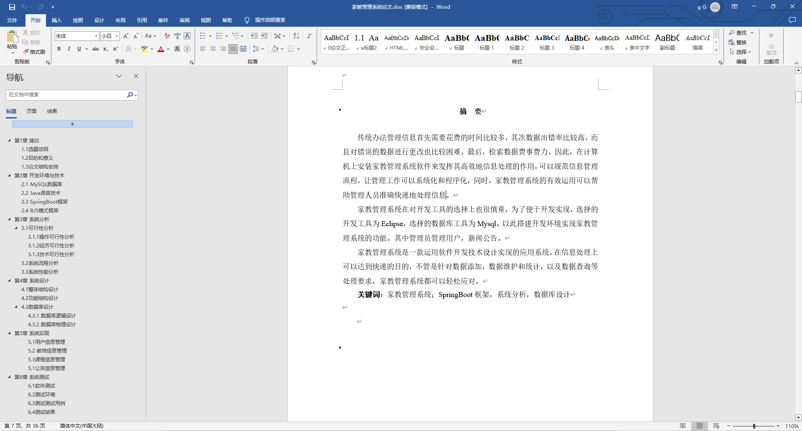
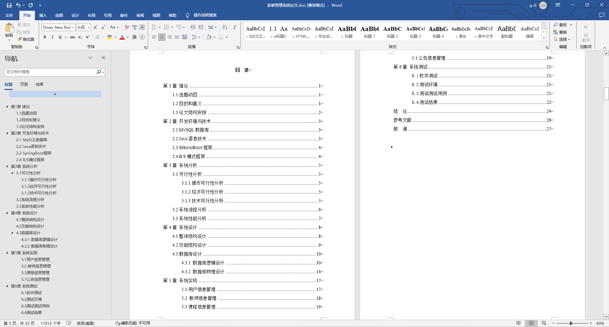
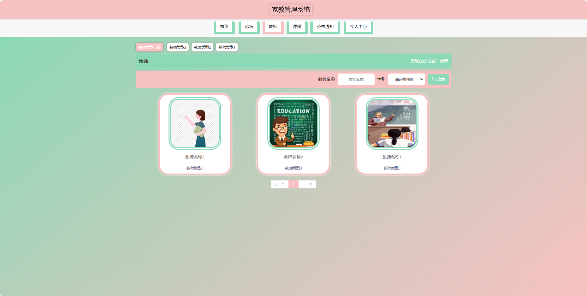
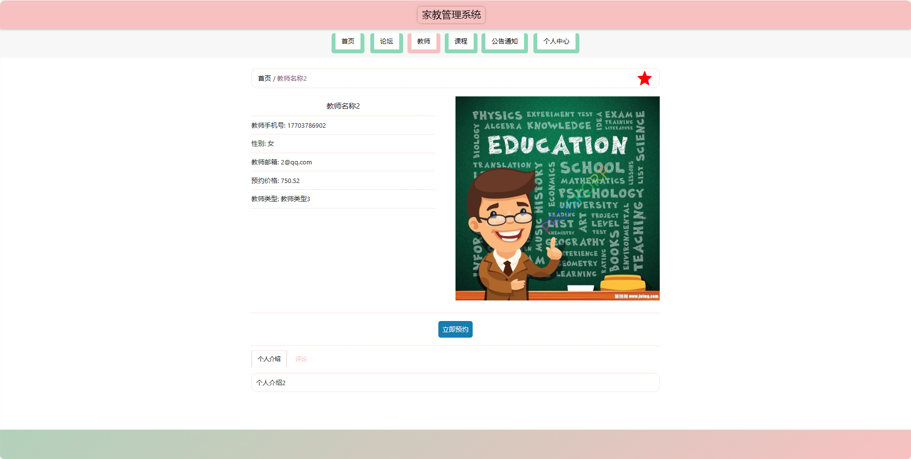
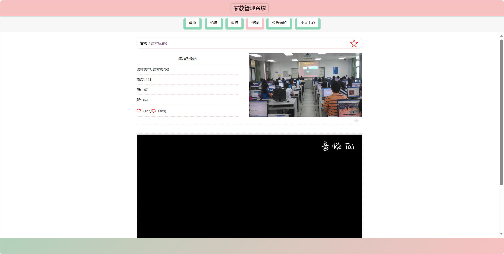

基于Springboot的家教管理系统（程序+论文）
=
### 完整代码获取地址：从戎源码网 ([https://armycodes.com/](https://armycodes.com/))
### 作者微信：19941326836  QQ：952045282 
### 承接计算机毕业设计、Java毕业设计、Python毕业设计、深度学习、机器学习
### 选题+开题报告+任务书+程序定制+安装调试+论文+答辩ppt 一条龙服务
### 所有选题地址https://github.com/nature924/allProject

一、项目介绍
---
基于Spring Boot框架实现的家教管理系统，系统包含三种角色：管理员、用户,教师主要功能如下。
### 【用户功能】

1. **首页：** 浏览家教管理系统的主要信息。
2. **论坛：** 参与用户间的交流和讨论。
3. **教师：** 查看教师列表。
4. **课程：** 浏览和选择适合的课程。
5. **公告通知：** 获取系统发布的重要通知和公告。
6. **个人中心：** 管理个人信息，包括修改密码等。

### 【管理员功能】

1. **首页：** 查看家教管理系统的整体。
2. **个人中心：** 修改密码、管理个人信息。
3. **管理员管理：** 审核和管理注册管理员用户的信息。
4. **用户管理：** 审核和管理注册用户的信息。
5. **教师管理：** 管理教师信息，包括评价和收藏管理。
6. **预约信息管理：** 查看和管理用户对教师的预约信息。
7. **课程管理：** 管理课程信息，包括留言和收藏管理。
8. **基础数据管理：** 管理系统的基础数据，包括教师类型、课程类型、公告类型等。
9. **论坛管理：** 管理用户间的讨论和交流。
10. **公告通知管理：** 发布、编辑和删除公告通知。
11. **轮播图信息：** 管理系统首页的轮播图。

### 【教师功能】

1. **首页：** 查看个人信息和系统通知。
2. **个人中心：** 修改密码、管理个人信息。
3. **教师管理：** 查看教师评价和收藏信息。
4. **预约信息管理：** 查看用户对教师的预约信息。
5. **课程管理：** 管理个人的课程信息，包括留言管理。
6. **论坛管理：** 参与论坛的讨论和交流。
7. **公告通知管理：** 查看系统发布的公告通知。

二、项目技术
---
- 编程语言：Java
- 数据库：MySQL
- 项目管理工具：Maven
- 前端技术：VUE、HTML、Jquery、Bootstrap
- 后端技术：Spring、SpringMVC、MyBatis

三、运行环境
---
- 操作系统：Windows、macOS都可以
- JDK版本：JDK1.8以上都可以
- 开发工具：IDEA、Ecplise、Myecplise都可以
- 数据库: MySQL5.7以上都可以
- Tomcat：任意版本都可以
- Maven：任意版本都可以

四、运行截图
---
### 论文截图：

### 程序截图：

